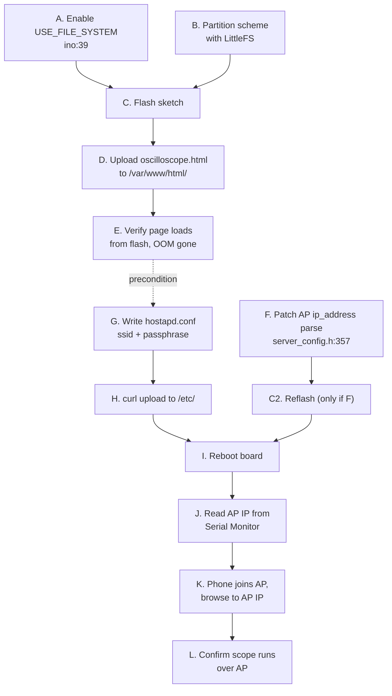

# Portable ESP32 Oscilloscope: Plan

## Goal

Run the oscilloscope on battery anywhere. The board broadcasts its own WiFi
access point, your phone joins it, and you view the scope in a browser. No
router or phone hotspot required.

## Status legend

`[x]` done · `[ ]` pending · `[~]` optional

## Task DAG



Two chains feed the reboot at I. The config chain (G to H) is required. The
patch chain (F to C2) is optional and only matters if you want a fixed AP IP
instead of the default.

## Tasks

### Done

- [x] **A. Enable filesystem** at [Esp32_oscilloscope.ino:39](Esp32_oscilloscope.ino#L39). Activates LittleFS, the FTP server, and flash-based HTTP serving.
- [x] **B. Partition scheme.** Arduino IDE, Tools, Partition Scheme, an option that reserves SPIFFS/LittleFS space.
- [x] **C. Flash sketch.** First boot creates `/var/www/html/` and seeds the config files.
- [x] **D. Upload HTML.** `curl.exe -T html\oscilloscope.html ftp://<IP>/var/www/html/oscilloscope.html --user root:root`
- [x] **E. Verify.** Page loads, the `[httpConn] out of memory` on load is gone.

### Pending: AP setup

- [ ] **G. Write `hostapd.conf`** locally. Passphrase needs 8 or more characters:
  ```
  ssid Oscilloscope
  wpa_passphrase MyScopePass123
  ```
- [ ] **H. Upload it**, overwriting the board copy that ships with an empty SSID:
  ```powershell
  curl.exe -T hostapd.conf ftp://<BOARD-IP>/etc/hostapd.conf --user root:root
  ```
- [ ] **I. Reboot.** Reset button or power cycle. [WiFi_start](server_config.h#L409) reads the new SSID and starts the AP.
- [ ] **J. Read the AP IP** from Serial Monitor at 115200. Look for `[WiFi][AP] static IPv4 address: ...`.
- [ ] **K. Join from phone.** WiFi settings, connect to `Oscilloscope`, open the AP IP.
- [ ] **L. Confirm** the scope streams over the AP connection.

### Optional: predictable AP IP

- [~] **F. Patch the parser** so the AP honors `192.168.1.1` from [server_config.h:64](server_config.h#L64). This version reads only netmask and gateway from `/etc/dhcpcd.conf` at [server_config.h:357-363](server_config.h#L357), never the `ip_address`, so `softAPConfig()` gets skipped and the board falls back to its default. Requires a reflash (C2).

## Key facts

- **AP IP defaults to `192.168.4.1`.** The config file says `192.168.1.1`, but
  the library never parses that line into `AP_IP`, so the ESP32 default wins.
  Trust the Serial Monitor value, not the config file. Task F fixes this.
- **Config lives in flash, not the `#define`s.** Once USE_FILE_SYSTEM is on,
  WiFi settings come from `/etc/hostapd.conf` and `/etc/wpa_supplicant.conf`.
  The `#define`s in `server_config.h` only seed those files on first boot, and
  the files already exist. Edit the files to change behavior, or delete them to
  regenerate from the defines.
- **AP plus STA runs both radios.** Your home WiFi credentials stay in
  `/etc/wpa_supplicant.conf`, so the board joins your router at home and
  broadcasts its own AP everywhere. Away from home the STA half fails quietly
  and the AP keeps working.
- **The parser trims whitespace.** Leading spaces, tabs, and `=` collapse to
  single spaces ([threadSafeFS.cpp:632-637](file:///c:/Users/aaron/OneDrive/Documents/Arduino/libraries/ThreadSafeFS/src/threadSafeFS.cpp#L632)), so the `hostapd.conf` format is forgiving.
- **FTP login ignores credentials.** Any user and password work. This build
  drops every login at `/` ([ftpServer.cpp:256](file:///c:/Users/aaron/OneDrive/Documents/Arduino/libraries/ESP32_Multitasking_Network_Suite/src/ftpServer.cpp#L256)).
- **Phone keeps cellular data.** While the phone sits on the board's
  internet-less AP, Android and iOS route everything else over cellular.
- **DHCP can change the STA IP** after a reboot at home. The AP IP stays fixed.

## Open decision

Run task F for a predictable `192.168.1.1`, or skip it and read `192.168.4.1`
from Serial Monitor each session. F costs one reflash and a two-line edit.
